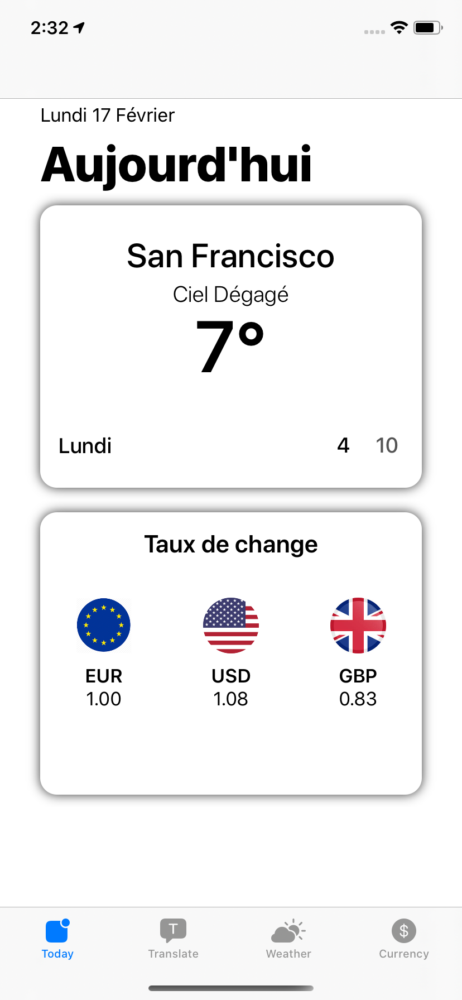
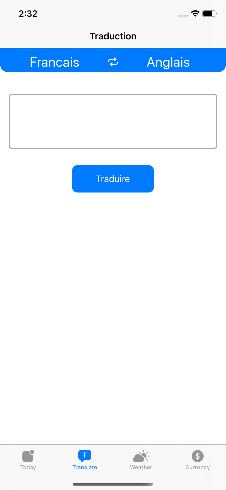
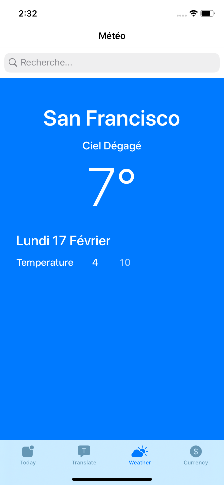
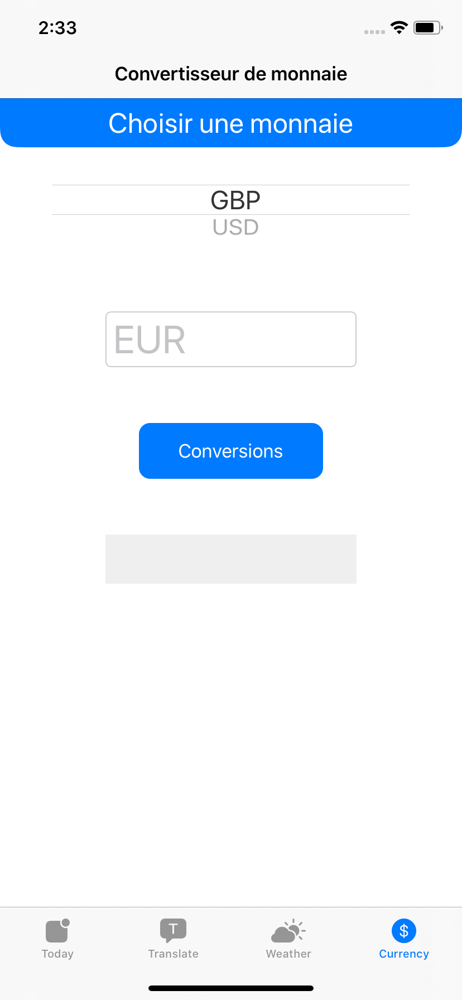

       

# Baluchon
🔥 Travelling the USA has never been so easy

&nbsp; &nbsp; &nbsp; &nbsp; &nbsp; &nbsp; &nbsp;  

## ☀️ About
Baluchon is the app to travel in USA. It will let you know the weather at your location but also where you want. Translate texts from french to english and vice versa. Exchange rate from Euro to United States Dollar and Pound sterling.

At the very beginning, I had to build an app with three pages for [Openclassrooms](https://openclassrooms.com/). I decided to add a fourth page name Today where users can have quick look on weather at there location and a live rate change of the day.

## 💻 Requirements
Baluchon is written in Swift 5 and supports iOS 13.0+. Built with Xcode 11.

## 🍀 Architecture
I decided to deal with this app with a [MVVM](https://medium.com/better-programming/mvvm-in-ios-from-net-perspective-580eb7f4f129) architectural pattern.

## 🛠 Dependencies
As activity indicator i use [NVActivityIndicatorView](https://github.com/ninjaprox/NVActivityIndicatorView) and for a better Swift Style [SwiftLint](https://github.com/realm/SwiftLint).
I use [CocoaPods](https://cocoapods.org) as dependency manager.

## 🕵️‍♂️ How to test 
### Clone the project

Run `git@github.com:fabricetiennette/Baluchon.git` 

### Install dependencies

Run `pod install`

### Workspace

Open `Baluchon.xcworkspace`

Build & Run 🔥
